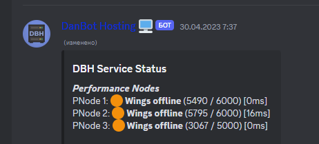

  

<h3 align="center">💥 Pterodactyl Crasher</h3>
<h3 align="center">The project is being finalized by Ikdan..</h3>

---

  
   
  <em>An example of the work.</em>

---

💣 Pterodactyl Crasher — It is a powerful tool designed to help combat low-quality Pterodactyl servers. This program allows users to simulate situations where resources are redistributed (Runtime Allocation Call), which can lead to node failures. Designed for educational and research purposes, Pterodactyl Crasher helps administrators and developers identify and eliminate potential vulnerabilities, as well as prevent unreliable hosts from causing harm.
      

## 📝 Обзор

- [📝 Review](#-review)
- [🧐 About the project](#about-the-project)
- [🏁 So let's get started](#go)
  - [Installation](#installation)
- [⛏️ Programming languages](#️programming-languages)
- [✍️ Authors ](#️-authors-)
 

## 🧐 About the project 

Pterodactyl Crasher — This tool is designed to help you take action against unscrupulous hosting providers. It generates large files and creates a heavy load, which can eventually overload the server. This process is known as Runtime Allocation Call, and it can be used to disrupt the services of the hosting provider. However, it's important to note that you are responsible for any consequences that may result from using this method.

## 🏁 So let's get started 

First, we choose the programming language that you need: we have Java, Python, JavaScript. Choose the appropriate one. See the [Installation](#installation) section to find out how to run it on the hosting. 

### Installation

Fill in the files: If you use JS, there are two files; if Python, there is only one, and so on. Once you have filled in the files, just run them! Remember that the names of the files may be different for the start command and the source file.

## ⛏️ Programming languages 
Our script is available in programming languages such as:

- Python
- JavaScript
- Java
- Rust
- Lua

## ✍️ Authors 

- [@xdearboy](https://github.com/xdearboy/) - Developed scripts. Javascript + Python.
- [@noxcel](https://github.com/Nocxell) - Gave me an idea, Java.
- [@vladdis](https://discord.com/invite/k-protect-community-public-925337010779078676) - Rust + Python script to run it.
- [@pm-kirill](https://github.com/PM-KIRILL) - The Bulba Core-Nodes have reviewed the project.
- [@IkdanYT](https://github.com/ikdanYT) - Modified jar file, great person.
